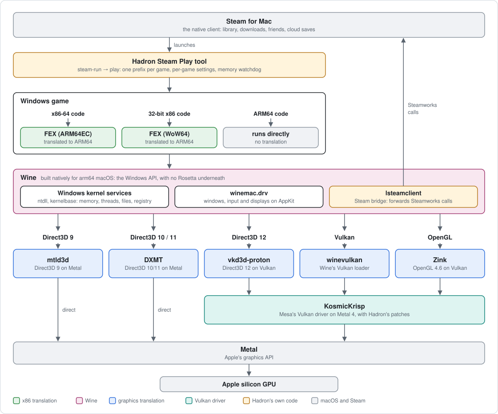

# Hadron

An open-source, Proton-style compatibility tool for Apple Silicon Macs: install and play
Windows games from the Steam library of the native Mac Steam client. Nothing runs under
Rosetta. Wine is built natively for arm64, FEX translates the game's x86 code, and Direct3D
and Vulkan are translated to Metal.

Hadron is in early development. A handful of games play well, many don't start yet, and there
are no binary releases: you build it from source.

## How it works

<picture>
  <source media="(prefers-color-scheme: dark)" srcset="docs/architecture-dark.svg">
  
</picture>

| Layer | Component | Role |
|---|---|---|
| Windows API | [Wine](https://www.winehq.org), upstream master with Hadron's patches | Built as a native arm64 macOS program |
| x86 translation | [FEX](https://github.com/FEX-Emu/FEX) | Runs inside Wine as its ARM64EC (x86-64) and WoW64 (32-bit x86) emulator |
| Direct3D 9 | [mtld3d](https://github.com/athei/mtld3d) | Direct to Metal |
| Direct3D 10 and 11 | [DXMT](https://github.com/3Shain/dxmt) | Direct to Metal |
| Direct3D 12 | [vkd3d-proton](https://github.com/HansKristian-Work/vkd3d-proton) | On Vulkan |
| Vulkan | KosmicKrisp, the Metal driver in [Mesa](https://mesa3d.org), with Hadron's patches | On Metal 4 |
| OpenGL | Wine's OpenGL on Apple's OpenGL 4.1 | Zink (OpenGL 4.6 on Vulkan) is planned |
| Steam | [NotProton](https://github.com/NotProtonNot/NotProton)'s Steam Play hook and an lsteamclient bridge | The Mac Steam client serves the game: sign-in, friends, cloud saves |

Fixes go into these shared layers, never into per-game hacks, and the graphics drivers only
report features they really implement. [docs/architecture.md](docs/architecture.md) covers the
macOS constraints behind the design, [docs/findings.md](docs/findings.md) is the log of what
was measured and fixed along the way, and [docs/conformance.md](docs/conformance.md) has the
results of the Khronos conformance suites on the graphics drivers.

## Status

| Game | Graphics | Result |
|---|---|---|
| Portal, Portal 2 | Direct3D 9 | Play fully |
| Five Nights at Freddy's, Ultimate Custom Night | Direct3D 9 | Run well |
| Among Us | Direct3D 11 | Runs, online sign-in works |
| Teardown | Direct3D 12 | Runs; frame rate is held back by CPU translation |
| Geometry Dash | OpenGL | Runs |
| Subnautica 2 (Unreal Engine 5) | Direct3D 12 | Being tested: the driver now provides the shader model 6.6 features Unreal requires |

[docs/test-games.md](docs/test-games.md) has the details and [docs/roadmap.md](docs/roadmap.md)
the order of work. Not in scope for now: games with kernel-level anti-cheat, and games that need
a third-party launcher.

## Requirements

- An Apple Silicon Mac with macOS 27. Hadron has only been built and run there.
- Xcode with its Metal toolchain, and Homebrew.
- An Apple Developer account. Windows needs memory below 4GB, which macOS only grants to a
  loader signed with the cross-architecture entitlement; see
  [docs/apple-developer-setup.md](docs/apple-developer-setup.md). Without it, the dev build
  below runs 64-bit programs only.
- The Mac Steam client, to play games from your library.

## Building

```sh
scripts/setup-toolchain.sh     # Homebrew dependencies and llvm-mingw
scripts/fetch.sh               # clone the upstream sources and apply patches/
scripts/build-wine.sh          # Wine -> dist/
scripts/build-fex.sh           # FEX's emulator DLLs
scripts/build-llvm15.sh        # static LLVM 15, for DXMT's shader compiler
scripts/build-dxmt.sh          # Direct3D 10/11
scripts/build-mtld3d.sh        # Direct3D 9 (Rust; see the script for the MSVC CRT licence step)
scripts/build-vulkan.sh        # KosmicKrisp, vkd3d-proton and DXVK's DXGI
scripts/build-lsteamclient.sh  # the Steam bridge
scripts/build-launcher.sh      # hadron-steam.exe
scripts/package-loader.sh <profile.provisionprofile>   # sign the loader with the entitlement
```

Then add Hadron to Steam:

```sh
scripts/build-steam-play.sh    # the Steam Play integration
scripts/steam-install          # install it into Steam.app (scripts/steam-uninstall undoes it)
```

Install and play Windows games from the Steam library as usual. A game that also has a Mac
version needs Properties -> Compatibility -> Hadron to get its Windows build.

## Running and debugging

```sh
scripts/wine-run <program.exe>            # run a program in the test prefix, with a clean environment
scripts/play <appid> <path/to/game.exe>   # run a game outside Steam, with the memory watchdog
scripts/stop                              # stop every Hadron process
```

Each Steam launch logs to `steamapps/compatdata/<appid>/hadron-run.log` and to
`build/logs/<appid>-*.log`. Settings are environment variables, given as a game's Steam launch
options or per app ID in `config/games.conf`; `scripts/play` documents them.

`scripts/build-wine.sh --dev` builds a variant that needs no entitlement, with Windows' fixed
low addresses moved above 4GB. It runs 64-bit programs only, through `scripts/wine-dev`.

## Repository layout

```
sources.conf          upstream repositories and the revisions Hadron builds
patches/<component>/  Hadron's changes, as git format-patch queues applied by scripts/fetch.sh
scripts/              build, install and launch scripts
launcher/             hadron-steam.exe, the stand-in for Steam's Windows process
config/games.conf     per-game settings
tools/                test programs, Metal probes and benchmarks behind docs/findings.md
docs/                 architecture, findings, conformance, roadmap, test games, Apple developer setup
src/ build/ dist/     checkouts, build trees and the installed runtime (git-ignored)
```

## License

Hadron's own code is under the BSD 3-Clause license ([LICENSE.hadron](LICENSE.hadron)). The
patches in `patches/` carry the license of the project they modify (Wine's are
LGPL-2.1-or-later, FEX's and Mesa's MIT), and fetched upstream sources keep their own licenses.
See [LICENSE](LICENSE).
