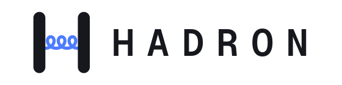

<h1 align="center">
  <picture>
    <source media="(prefers-color-scheme: dark)" srcset="docs/hadron-dark.svg">
    
  </picture>
</h1>

<p align="center">
  <a href="https://discord.gg/ShNTcxWjKN"></a>
  <a href="https://github.com/Broyojo/hadron/discussions"></a>
  <a href="https://github.com/Broyojo/hadron/releases/latest"></a>
</p>

An open-source way to play Windows games on Apple Silicon Macs: install and play them from the
Steam library of the native Mac Steam client. It is to the Mac what Proton is to Linux, and an
open-source alternative to CrossOver for Steam games. Nothing runs under Rosetta: Wine is built
natively for arm64, FEX translates the game's x86 code, and Direct3D, Vulkan and OpenGL are
translated to Metal.

Hadron is in early development. A handful of games play well and many don't start yet;
[docs/test-games.md](docs/test-games.md) says which.

## Install

You need an Apple Silicon Mac with macOS 27 and [Steam for Mac](https://store.steampowered.com/about/).

With [Homebrew](https://brew.sh):

```sh
brew install --cask broyojo/hadron/hadron
```

Or download the disk image from the [latest release](https://github.com/Broyojo/hadron/releases/latest)
and drag Hadron to Applications.

Then open Hadron once and choose **Set up Steam**. macOS stops the first attempt, because Hadron
is changing another app: allow Hadron under System Settings, Privacy & Security, App Management,
and set up again. That adds Hadron to Steam as a Steam Play tool (Uninstall takes it out again).
After that Hadron does not need to be open: install and play Windows games from your Steam
library as usual. A game that also has a Mac version needs Properties -> Compatibility -> Hadron
to get its Windows build.

Everything the window does is also a command: `hadron setup`, `hadron uninstall`, `hadron status`
(`hadron help` lists them). Homebrew installs the `hadron` command. With the disk image, Hadron's
window offers to add it; it goes into `/usr/local/bin`, so macOS asks for your password.

To remove Hadron, take it out of Steam first (Uninstall in the window, or `hadron uninstall`),
then delete the app or run `brew uninstall --cask hadron`. If you had the window add the `hadron`
command, remove that link too: `sudo rm /usr/local/bin/hadron`.

If something does not work, [CONTRIBUTING.md](CONTRIBUTING.md) says how to report it. Questions,
and which games work for you, go to
[Discussions](https://github.com/Broyojo/hadron/discussions) or the
[Discord](https://discord.gg/ShNTcxWjKN).

To build it yourself instead, see [Building](#building).

## Before you try it

- **It is unofficial.** Hadron is not affiliated with or endorsed by Valve, Apple, CodeWeavers or
  any of the projects it builds on.
- **It changes Steam.** Setting up adds a library to `/Applications/Steam.app` and signs that app
  again, which replaces Valve's signature on it. That is how Steam for Mac learns to offer
  Windows games. Uninstall in Hadron takes it out, and reinstalling Steam from Valve restores
  Valve's signature. A Steam update can undo the setup; open Hadron and choose Repair. Valve has
  said nothing about tools like this on the Mac either way, so use it at your own risk.
- **It is early.** A handful of games play well ([Status](#status)). Many do not start yet.
  Games with kernel-level anti-cheat, which means most competitive multiplayer games, are not
  expected to work, and neither are games that need a third-party launcher.
- **First launches are slow.** A game's first start sets up its Windows environment and
  compiles its shaders, and the first start after a Hadron update compiles them again.
- **Nothing about you is sent anywhere.** There is no telemetry. The one request Hadron makes
  on its own is to GitHub, when you open its window, to see whether a newer version exists. If
  something breaks, Hadron can save a report file for you to attach to an issue yourself.

## How it works

<picture>
  <source media="(prefers-color-scheme: dark)" srcset="docs/architecture-dark.svg">
  
</picture>

| Layer | Component | Role |
|---|---|---|
| Windows API | [Wine](https://www.winehq.org), a pinned revision of upstream with Hadron's patches | Built as a native arm64 macOS program |
| x86 translation | [FEX](https://github.com/FEX-Emu/FEX) | Runs inside Wine as its ARM64EC (x86-64) and WoW64 (32-bit x86) emulator |
| Direct3D 9 | [mtld3d](https://github.com/athei/mtld3d) | Direct to Metal |
| Direct3D 10 and 11 | [DXMT](https://github.com/3Shain/dxmt) | Direct to Metal |
| Direct3D 12 | [vkd3d-proton](https://github.com/HansKristian-Work/vkd3d-proton) | On Vulkan |
| Vulkan | KosmicKrisp, the Metal driver in [Mesa](https://mesa3d.org), with Hadron's patches | On Metal 4 |
| OpenGL | [Zink](https://docs.mesa3d.org/drivers/zink.html), Mesa's OpenGL on Vulkan, on KosmicKrisp | OpenGL 4.6, core and compatibility; [conformance](docs/conformance.md) lists the gaps left |
| Steam | [NotProton](https://github.com/NotProtonNot/NotProton)'s Steam Play hook and an lsteamclient bridge | The Mac Steam client serves the game: sign-in, friends, cloud saves |

Fixes go into these shared layers, never into per-game hacks, and the graphics drivers only
report features they really implement. [docs/architecture.md](docs/architecture.md) covers the
macOS constraints behind the design, [docs/findings.md](docs/findings.md) is the log of what
was measured and fixed along the way, and [docs/conformance.md](docs/conformance.md) has the
results of the Khronos conformance suites on the graphics drivers.

## Status

| Game | Graphics | Result |
|---|---|---|
| Portal, Portal 2 | Direct3D 9 | Play fully |
| Five Nights at Freddy's, Ultimate Custom Night | Direct3D 9 | Run well |
| Among Us | Direct3D 11 | Runs, online sign-in works |
| Teardown | Direct3D 12 | Runs; frame rate is held back by CPU translation |
| Subnautica | Direct3D 11 | Runs well |
| Geometry Dash | OpenGL | Runs well |
| Astroneer (Unreal Engine 4) | Direct3D 11 | Runs well |
| Besiege | Direct3D 11 | Runs |
| 5D Chess With Multiverse Time Travel | OpenGL | Runs |
| Slay the Spire (Java) | OpenGL | Does not start yet: a Java exception at start-up, cause not established |
| Subnautica 2 (Unreal Engine 5) | Direct3D 12 | Does not load yet: Metal's shader compiler gives up on its largest compute shaders |

[docs/test-games.md](docs/test-games.md) has the details and [docs/roadmap.md](docs/roadmap.md)
the order of work. Not in scope for now: games with kernel-level anti-cheat, and games that need
a third-party launcher.

## Building

To build Hadron yourself you need:

- An Apple Silicon Mac with macOS 27. Hadron has only been built and run there.
- Xcode with its Metal toolchain, and Homebrew.
- An Apple Developer account. Windows needs memory below 4GB, which macOS only grants to a
  loader signed with the cross-architecture entitlement; see
  [docs/apple-developer-setup.md](docs/apple-developer-setup.md). Without it, the dev build
  below runs 64-bit programs only.
- The Mac Steam client, to play games from your library.

Then:

```sh
scripts/setup-toolchain.sh     # Homebrew dependencies and llvm-mingw
scripts/fetch.sh               # clone the upstream sources and apply patches/
scripts/build-ffmpeg.sh        # FFmpeg, decoding only, for Wine's media playback
scripts/build-vulkan.sh        # KosmicKrisp, Zink, vkd3d-proton and DXVK's DXGI (before Wine, which looks for Zink's EGL)
scripts/build-wine.sh          # Wine -> dist/
scripts/build-fex.sh           # FEX's emulator DLLs
scripts/build-llvm15.sh        # static LLVM 15, for DXMT's shader compiler
scripts/build-dxmt.sh          # Direct3D 10/11
scripts/build-mtld3d.sh        # Direct3D 9 (Rust; see the script for the MSVC CRT licence step)
scripts/build-lsteamclient.sh  # the Steam bridge
scripts/build-launcher.sh      # hadron-steam.exe
scripts/package-loader.sh <profile.provisionprofile>   # sign the loader with the entitlement
```

Then add Hadron to Steam:

```sh
scripts/build-steam-play.sh    # the Steam Play integration
scripts/steam-install          # install it into Steam.app (scripts/steam-uninstall undoes it)
```

Steam then runs games straight from this checkout. `scripts/build-app.sh` builds `Hadron.app`
around a self-contained copy of the runtime (`scripts/package-runtime.sh`), with no reference to
the checkout or to Homebrew: what a release carries.

## Running and debugging

```sh
scripts/wine-run <program.exe>            # run a program in the test prefix, with a clean environment
scripts/play <appid> <path/to/game.exe>   # run a game outside Steam, with the memory watchdog
scripts/stop                              # stop every Hadron process
```

Each Steam launch logs to `steamapps/compatdata/<appid>/hadron-run.log` and to
`build/logs/<appid>-*.log` (`~/Library/Logs/Hadron` for the installed app). Settings are environment variables, given as a game's Steam launch
options or per app ID in `config/games.conf`; `scripts/play` documents them.

`scripts/build-wine.sh --dev` builds a variant that needs no entitlement, with Windows' fixed
low addresses moved above 4GB, and `scripts/build-fex.sh --dev` gives it the x86 translator. It
runs 64-bit programs only, through `scripts/wine-dev`.

## Repository layout

```
sources.conf          upstream repositories and the revisions Hadron builds
patches/<component>/  Hadron's changes, as git format-patch queues applied by scripts/fetch.sh
scripts/              build, install and launch scripts
launcher/             hadron-steam.exe, the stand-in for Steam's Windows process, and hadron-icon
app/                  Hadron.app: the window and the hadron command (scripts/build-app.sh)
assets/logo/          the logo and the app icon, as drawings
packaging/            entitlements, the list of third-party components, the Homebrew cask
config/games.conf     per-game settings
tools/                test programs, Metal probes and benchmarks behind docs/findings.md
docs/                 architecture, findings, conformance, roadmap, test games, Apple developer setup
AGENTS.md             how to work on Hadron: what a fix is, evidence, running games safely
src/ build/ dist/     checkouts, build trees and the installed runtime (git-ignored)
```

## How it was made

Most of Hadron's code was written by a coding agent, [Claude Code](https://claude.com/claude-code)
running Claude Opus 5.5, directed and tested by its author; the commits say so in their trailers.
What it claims rests on tests rather than on who typed it: the games in
[docs/test-games.md](docs/test-games.md), and the Khronos conformance suites for Vulkan and
OpenGL, whose results and known gaps are in [docs/conformance.md](docs/conformance.md).

Fixing things the same way is welcome, and probably the way this project scales: a game's report
and this repository are what an agent needs to start on a game that fails. How you work is up to
you. Patches follow their upstreams' rules on AI-written code
([CONTRIBUTING.md](CONTRIBUTING.md)).

## License

Hadron's own code is under the BSD 3-Clause license ([LICENSE.hadron](LICENSE.hadron)). The
patches in `patches/` carry the license of the project they modify (Wine's are
LGPL-2.1-or-later, FEX's and Mesa's MIT, NotProton's GPL-3.0), and fetched upstream sources keep
their own licenses. See [LICENSE](LICENSE). The app carries every component's license and a list
of what it was built from, in `Contents/SharedSupport/runtime/licenses`.

## Stars

<a href="https://www.star-history.com/#Broyojo/hadron&Date">
  <picture>
    <source media="(prefers-color-scheme: dark)" srcset="https://api.star-history.com/svg?repos=broyojo%2Fhadron&type=Date&theme=dark">
    
  </picture>
</a>
